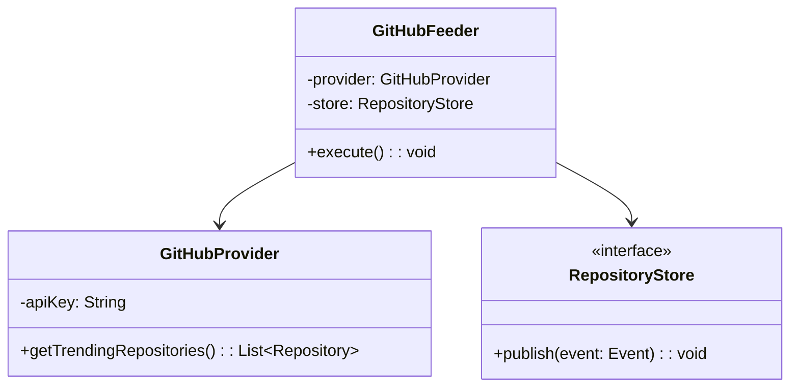
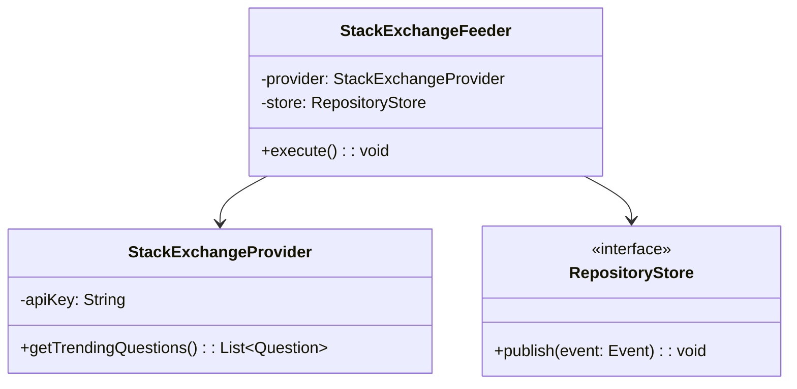
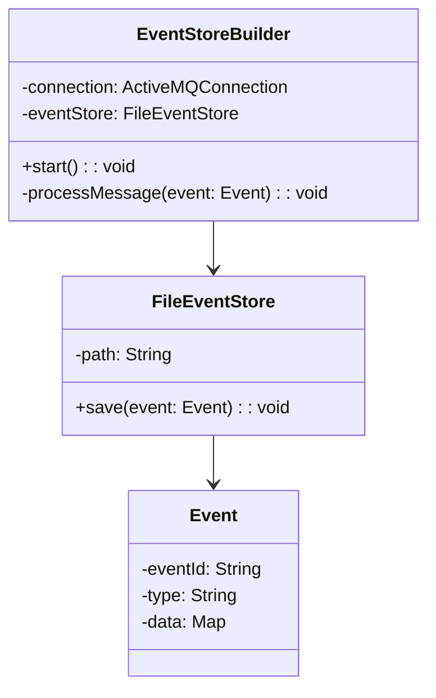
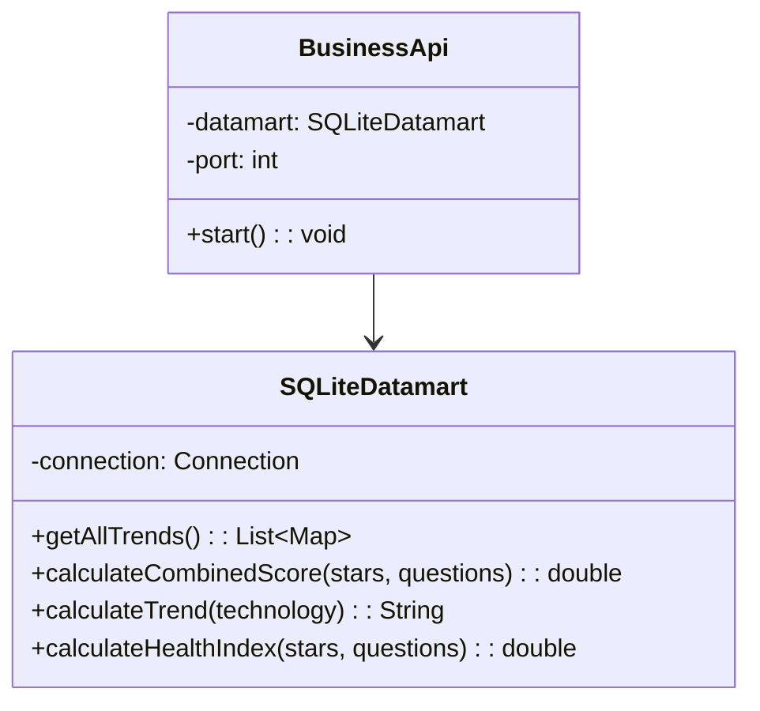

# 🚀 Techno Radar
**Plataforma Avanzada de Análisis de Tendencias Tecnológicas**


Empoderando a desarrolladores e innovadores con insights impulsados por análisis integral de repositorios GitHub e integración de datos de Stack Exchange en tiempo real.

---

## 📋 Tabla de Contenidos
- [📜 Descripción](#-descripción)
- [✨ Características](#-características)
- [🔌 APIs Utilizadas](#-apis-utilizadas)
- [🏗️ Arquitectura](#️-arquitectura)
- [💾 Estructura del Datamart](#-estructura-del-datamart)
- [📐 Diagramas de Clases](#-diagramas-de-clases)
- [🔧 Requisitos](#-requisitos)
- [🚀 Instalación y Uso](#-instalación-y-uso)
- [👥 Autores](#-autores)
- [📄 Licencia](#-licencia)

---

## 📜 Descripción

**Techno Radar** es una plataforma de análisis de tendencias tecnológicas que estudia distintos parámetros de las tecnologías más populares basándose en su actividad en **GitHub** y en **Stack Exchange**.

El objetivo es proporcionar a desarrolladores, innovadores y empresas información detallada y relevante que les permita:
- ✅ Identificar qué tecnologías están en auge
- ✅ Detectar qué tecnologías están consolidadas
- ✅ Reconocer qué tecnologías están en declive

Además de los datos de GitHub (estrellas, actividad), el sistema utiliza información proveniente de Stack Exchange (cantidad de preguntas), permitiendo obtener datos de calidad de cada tecnología. El resultado es un **datamart consolidado y actualizado** que permite visualizar tendencias en tiempo real a través de un **dashboard interactivo**.

---

## ✨ Características

Techno Radar ofrece un conjunto completo de características diseñadas para proporcionar análisis profundos y precisos de tendencias tecnológicas:

- 🔍 **Recolección de Datos en Tiempo Real**: Extracción automatizada de datos desde las APIs de GitHub y Stack Exchange
- 📊 **Análisis Combinado**: Integración de métricas de GitHub (estrellas) y Stack Exchange (preguntas)
- 🎯 **Score Combinado**: Algoritmo que pondera ambas fuentes para obtener una puntuación 0-100
- 📈 **Análisis de Tendencias**: Detección automática de tecnologías en crecimiento, decrecimiento o estables
- ❤️ **Índice de Salud Tecnológica**: Métrica que evalúa la salud general de cada tecnología
- 🖥️ **Dashboard Interactivo**: Visualización en tiempo real con 5 gráficos diferentes
- 🔄 **API REST**: Endpoints para consumir datos de tendencias
- ⏱️ **Actualizaciones Periódicas**: Cada 10 segundos para mantener datos recientes
- 📋 **Arquitectura Modular**: Diseño limpio y extensible

---

## 🔌 APIs Utilizadas

Hemos escogido la API de **GitHub** y la de **Stack Exchange** por su relevancia en la comunidad tecnológica global, siendo fuentes confiables de actividad y popularidad de tecnologías.

| API | Propósito | Métricas |
|-----|----------|----------|
| **GitHub API** | Análisis de popularidad de proyectos | Estrellas, Issues, Commits, Watchers |
| **Stack Exchange API** | Análisis de soporte comunitario | Preguntas, Respuestas, Actividad |

La combinación de ambas fuentes permite correlacionar la popularidad con la actividad comunitaria, proporcionando una visión holística de cada tecnología.

---

## 🏗️ Arquitectura

### Diagrama de Flujo del Sistema

```mermaid
graph LR
    subgraph Producers["🌟 Productores"]
        A1["GitHub Feeder"]:::producer
        A2["Stack Exchange Feeder"]:::producer
    end
    
    subgraph Broker["🔄 Broker (ActiveMQ)"]
        B1["github.Stars"]:::topic
        B2["stackoverflow.Questions"]:::topic
    end
    
    subgraph Subscriber["📥 Suscriptor"]
        C1["Event Store Builder"]:::subscriber
    end
    
    subgraph Storage["💾 Almacenamiento"]
        D1["Event Store"]:::storage
    end
    
    subgraph Processing["🧠 Procesamiento"]
        E1["Business Unit"]:::processor
    end
    
    subgraph DataStorage["📊 Datamart"]
        F1["SQLite DB"]:::datamart
    end
    
    subgraph Visualization["🖥️ Visualización"]
        G1["REST API"]:::api
        G2["Dashboard"]:::dashboard
    end
    
    A1 -->|Publica eventos| B1
    A2 -->|Publica eventos| B2
    B1 -->|Consume| C1
    B2 -->|Consume| C1
    C1 -->|Almacena| D1
    D1 -->|Lee eventos| E1
    E1 -->|Procesa y calcula| F1
    F1 -->|Consulta| G1
    G1 -->|Obtiene datos| G2
    
    classDef producer fill:#90EE90,stroke:#2d5a2d,stroke-width:2px,color:#000
    classDef topic fill:#87CEEB,stroke:#1e3a5a,stroke-width:2px,color:#000
    classDef subscriber fill:#FFB347,stroke:#5a3a1e,stroke-width:2px,color:#000
    classDef storage fill:#FF6B6B,stroke:#8b0000,stroke-width:2px,color:#fff
    classDef processor fill:#DA70D6,stroke:#4a1a5a,stroke-width:2px,color:#000
    classDef datamart fill:#DAA520,stroke:#5a4a1e,stroke-width:2px,color:#000
    classDef api fill:#20B2AA,stroke:#1a3a3a,stroke-width:2px,color:#fff
    classDef dashboard fill:#FF8C00,stroke:#5a3a1e,stroke-width:2px,color:#fff
```



### 🧩 Principios de Diseño Aplicados

- **Single Responsibility Principle**: Manteniendo el código modularizado, asignando a cada clase una única responsabilidad
- **Open/Closed Principle**: Facilitando la extensión del sistema sin modificar el código existente
- **Hexagonal Architecture**: Separación clara entre lógica de negocio e infraestructura
- **Event Sourcing**: Almacenamiento de todos los eventos para trazabilidad completa
- **Lambda Architecture**: Procesamiento en tiempo real y por lotes

Ejemplo de implementación:

```java
GitHubFeeder feeder = new GitHubFeeder(provider, store);
feeder.execute();

SQLiteDatamart datamart = new SQLiteDatamart("trends.db");
datamart.updateGithubTrend(technology, stars);
```

---

## 🧩 Módulos del Sistema

El proyecto consta de **4 módulos principales**:

1. **📊 GitHub Feeder**: Consulta la GitHub API cada 10 segundos y publica eventos con las estrellas de proyectos populares
2. **💬 Stack Exchange Feeder**: Consulta la Stack Exchange API cada 10 segundos y publica eventos con preguntas de tecnologías
3. **🗃️ Event Store Builder**: Consume mensajes de ActiveMQ y los almacena como eventos en el Event Store
4. **🧠 Business Unit**: Procesa el Event Store, calcula métricas avanzadas y expone una API REST con visualización en dashboard

```
techno-radar/
├── feeders/
│   ├── github-feeder/
│   │   ├── src/main/java/es/ulpgc/dacd/feeders/
│   │   └── pom.xml
│   └── stackexchange-feeder/
│       ├── src/main/java/es/ulpgc/dacd/feeders/
│       └── pom.xml
├── event-store-builder/
│   ├── src/main/java/es/ulpgc/dacd/eventstore/
│   └── pom.xml
├── business-unit/
│   ├── src/
│   │   ├── main/java/es/ulpgc/dacd/business/
│   │   │   ├── api/
│   │   │   ├── datamart/
│   │   │   └── util/
│   │   └── resources/
│   │       └── public/
│   │           └── index.html
│   └── pom.xml
└── README.md
```

---

## 💾 Estructura del Datamart

El datamart se estructura en una base de datos SQLite con dos tablas principales:

```sql
CREATE TABLE tech_trends (
    technology TEXT PRIMARY KEY,
    github_stars INTEGER DEFAULT 0,
    stack_questions INTEGER DEFAULT 0,
    last_updated TEXT DEFAULT (datetime('now'))
);

CREATE TABLE history (
    id INTEGER PRIMARY KEY AUTOINCREMENT,
    technology TEXT,
    stars INTEGER,
    questions INTEGER,
    date TEXT DEFAULT (date('now')),
    timestamp TEXT DEFAULT (datetime('now')),
    UNIQUE(technology, date)
);
```

### 📊 Ejemplo de Datos Generados

**Event Store Sample:**

```json
{
  "eventId": "ev-001",
  "type": "GITHUB_TREND",
  "technology": "Python",
  "stars": 45230,
  "timestamp": "2026-05-19T10:15:32Z"
}
```

**Datamart Sample:**

```
technology,github_stars,stack_questions,combined_score,trend,health_index,last_updated
Python,45230,523421,87.5,UP,95.2,2026-05-19T10:30:00
JavaScript,38120,489234,82.3,UP,89.1,2026-05-19T10:30:00
Java,32450,298471,76.4,STABLE,82.5,2026-05-19T10:30:00
```

---

## 📐 Diagramas de Clases

### 🌐 Diagrama de Clases del GitHub Feeder



### 💬 Diagrama de Clases del Stack Exchange Feeder



### 🗃️ Diagrama de Clases del Event Store Builder



### 🧠 Diagrama de Clases del Business Unit



---

## 🔧 Requisitos

- ☕ **JDK versión 21** o superior
- 📦 **Maven 3.8** o superior
- 📨 **ActiveMQ 5.15** instalado e iniciado en localhost:61616
- 🌐 Conexión a Internet para acceso a las APIs (GitHub y Stack Exchange)

---

## 🚀 Instalación y Uso

### 📥 Clona el Repositorio

```bash
git clone https://github.com/TechnoRadar/techno-radar.git
cd techno-radar
```

### 🔄 Flujo de Ejecución

El proyecto funciona siguiendo un orden de ejecución definido, utilizando el broker de mensajería ActiveMQ:

```
1. Iniciar ActiveMQ
2. Ejecutar GitHub Feeder
3. Ejecutar Stack Exchange Feeder
4. Ejecutar Event Store Builder
5. Ejecutar Business Unit
6. Acceder al dashboard en http://localhost:8081
```

### 1️⃣ Iniciar ActiveMQ

**En Windows:**

```bash
cd C:\path\to\activemq\bin
activemq.bat
```

**En macOS/Linux:**

```bash
cd /path/to/activemq/bin
./activemq
```

### 2️⃣ Ejecutar GitHub Feeder

```bash
cd feeders/github-feeder
mvn clean compile exec:java -Dexec.mainClass="es.ulpgc.dacd.feeders.GitHubFeederMain"
```

**Variables de Entorno Necesarias:**

```bash
GITHUB_API_KEY=tu_api_key_de_github
ACTIVE_MQ_URL=tcp://localhost:61616
```

**Cómo Obtener tu GitHub API Key:**
1. Ve a https://github.com/settings/tokens
2. Crea un nuevo token personal
3. Selecciona permisos de lectura pública
4. Copia el token

### 3️⃣ Ejecutar Stack Exchange Feeder

```bash
cd feeders/stackexchange-feeder
mvn clean compile exec:java -Dexec.mainClass="es.ulpgc.dacd.feeders.StackExchangeFeederMain"
```

**Variables de Entorno Necesarias:**

```bash
ACTIVE_MQ_URL=tcp://localhost:61616
```

### 4️⃣ Ejecutar Event Store Builder

```bash
cd event-store-builder
mvn clean compile exec:java -Dexec.mainClass="es.ulpgc.dacd.eventstore.EventStoreBuilderMain" -Dexec.args="tcp://localhost:61616 ./event-store"
```

**Argumentos:**
- tcp://localhost:61616 - URL del broker ActiveMQ
- ./event-store - Ruta donde guardar los eventos

### 5️⃣ Ejecutar Business Unit

```bash
cd business-unit
mvn clean compile exec:java -Dexec.mainClass="es.ulpgc.dacd.business.BusinessUnitMain" -Dexec.args="./techno-radar.db 8081"
```

**Argumentos:**
- ./techno-radar.db - Ruta de la base de datos SQLite
- 8081 - Puerto en el que correrá la API

### 🖥️ Acceder al Dashboard

Una vez que la Business Unit esté ejecutándose, abre tu navegador en:

```
http://localhost:8081
```

El dashboard mostrará:
- 📊 **Comparativa GitHub vs Stack Exchange** (top 15 tecnologías)
- ⭐ **Score Combinado** (0-100)
- 📈 **Tendencias Actuales** (UP/DOWN/STABLE)
- ❤️ **Índice de Salud Tecnológica**
- 🎯 **Radar con Top 5 Tecnologías**
- 📋 **Tabla completa de métricas**

---

## 🔌 API REST Endpoints

### Obtener Todas las Tendencias

```bash
GET http://localhost:8081/api/trends
```

**Respuesta:**

```json
[
  {
    "technology": "Python",
    "githubStars": 45230,
    "stackExchangeQuestions": 523421,
    "combinedScore": 87.5,
    "trend": "UP",
    "healthIndex": 95.2,
    "lastUpdated": "2026-05-19T10:30:00"
  },
  {
    "technology": "JavaScript",
    "githubStars": 38120,
    "stackExchangeQuestions": 489234,
    "combinedScore": 82.3,
    "trend": "UP",
    "healthIndex": 89.1,
    "lastUpdated": "2026-05-19T10:30:00"
  }
]
```

### Obtener Historial de una Tecnología

```bash
GET http://localhost:8081/api/trends/python/history
```

**Respuesta:**

```json
[
  {
    "technology": "Python",
    "stars": 45230,
    "questions": 523421,
    "date": "2026-05-19",
    "timestamp": "2026-05-19T10:30:00Z"
  },
  {
    "technology": "Python",
    "stars": 45100,
    "questions": 523200,
    "date": "2026-05-19",
    "timestamp": "2026-05-19T10:20:00Z"
  }
]
```

---

## 🧪 Validación y Tests

Para garantizar el correcto funcionamiento del sistema, se han implementado pruebas unitarias:

```bash
mvn test
```

**Cobertura de Tests:**
- ✅ Tests de consultas a GitHub API
- ✅ Tests de consultas a Stack Exchange API
- ✅ Tests de cálculo de métricas
- ✅ Tests de almacenamiento en Event Store
- ✅ Tests de consultas a SQLite Datamart

---

## 👥 Autores

Este proyecto fue creado por el equipo **Techno Radar**, contando con dos integrantes:

- 👨‍💻 **Javier Bolívar** - Javi05x
- 👨‍💻 **Lucas Rodríguez Hernández** - lucasrodriguezhdz

---

## 📄 Licencia

Este proyecto está licenciado bajo la licencia **MIT**. Consulta el archivo LICENSE para obtener más detalles.

---

### ⭐ Si te gusta este proyecto, no olvides darle una estrella en GitHub ⭐

**Última actualización:** Mayo 2026
